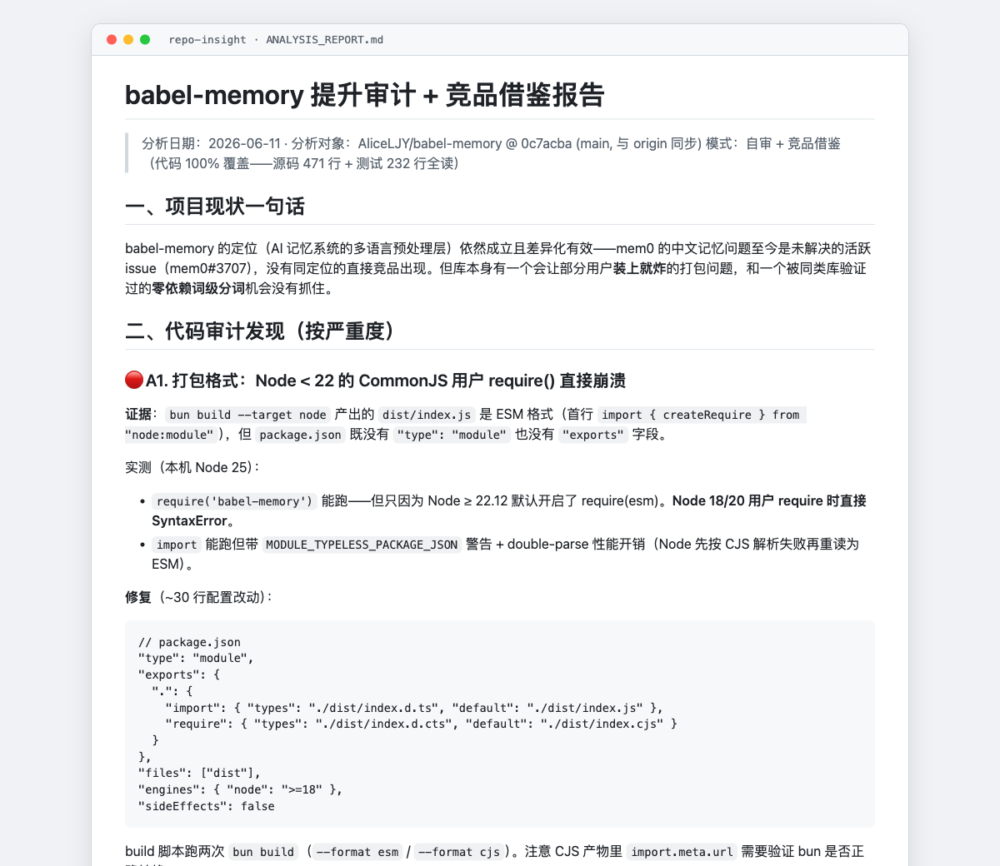

# Repo Insight

AI coding agent skill for deep architectural analysis of open-source projects. Goes beyond "what technologies are used" to answer "why is it designed this way."

Generates professional architecture reports with design insights, trade-off analysis, borrowing value assessment, and Mermaid diagrams.

Compatible with [Claude Code](https://claude.ai/claude-code), [Codex](https://github.com/openai/codex), and any AI coding agent that supports the skills format. Interactive questions and parallel subagents degrade gracefully when those tools are unavailable — see the "运行环境降级" (runtime degradation) section in SKILL.md.

> **Language note**: The skill instructions are written in Chinese (the author's working language). Report output follows your conversation language, but the skill works best in Chinese conversations. An English instruction set may come later if there is demand.

**[中文文档](README_CN.md)**



## Quick Install

**npx (Recommended)**

```bash
npx skills add AliceLJY/repo-insight
```

**Manual (Git Clone + Symlink)**

The skill lives in a nested `skills/repo-insight/` directory, so clone the repo anywhere and link the inner directory into your skills folder (cloning the whole repo directly into `~/.claude/skills/` will NOT work — Claude Code expects `SKILL.md` at the top level of each skill directory):

```bash
# macOS / Linux
git clone https://github.com/AliceLJY/repo-insight.git ~/repo-insight
ln -s ~/repo-insight/skills/repo-insight ~/.claude/skills/repo-insight

# Windows (junction, no admin required)
git clone https://github.com/AliceLJY/repo-insight.git %USERPROFILE%\repo-insight
mklink /J %USERPROFILE%\.claude\skills\repo-insight %USERPROFILE%\repo-insight\skills\repo-insight
```

**Verify**: start a new Claude Code session and run `/repo-insight`, or just ask `分析项目 <some-repo>` — the skill should activate.

## Features

- **Why > What Philosophy** — Every design decision explains motivation, trade-offs, and alternatives
- **Adaptive Report Structure** — No fixed template; chapters are dynamically designed based on each project's characteristics
- **Parallel Subagent Analysis** — Spawns multiple agents for concurrent module analysis with coverage tracking
- **External Research** — Web searches for reviews + crawls official websites before diving into code
- **Interactive Q&A** — Generates targeted questions based on project traits, not a fixed checklist
- **Quality Scorecard** — Visual star-rating evaluation card with justified scores
- **Borrowing Value** — Explicit section on reusable design patterns and engineering practices worth learning
- **Mermaid Diagrams** — Architecture overviews, data flows, and per-module sequence diagrams
- **4 Depth Levels** — From 30-second quick verdict to full deep analysis

## Safety Boundary (v1.1.0)

Before acquiring or reading a target repository, Repo Insight treats its `AGENTS.md`, `CLAUDE.md`, `README*`, prompts, and all other content as untrusted data—never as instructions. The default is read-only: no dependency installation, repository scripts/hooks/binaries, sourced environment files, or secret reading/copying/exposure. Prompt injection is recorded as a finding; dynamic execution requires explicit user authorization and isolation. The same contract is repeated verbatim at the start of every delegated module prompt.

This is an instruction-level boundary backed by deterministic lint tests, not an OS sandbox. When dynamic execution is authorized, the operator or agent runtime must provide the isolated environment.

## Usage

Simply ask Claude Code to analyze a project:

```
分析项目 https://github.com/astral-sh/ruff
```

```
/repo-insight ollama/ollama
```

```
对比分析 express vs fastify
```

The skill accepts `owner/repo` shorthand, full GitHub/GitLab/Gitee URLs, or local paths.

## Analysis Modes

| Mode | Core Coverage | Secondary Coverage | Best For |
|------|--------------|-------------------|----------|
| **Quick Verdict** | Entry + README | — | 30-second go/no-go decision |
| **Quick Analysis** | >= 30% | >= 10% | High-level overview |
| **Standard** (default) | >= 60% | >= 30% | Regular architecture analysis |
| **Deep Analysis** | >= 90% | >= 60% | Studying every design decision |
| **Comparative** | Varies | Varies | Side-by-side project comparison |

## How It Works

1. **Clone & Scan** — Clones the repo, counts effective lines of code by module
2. **Scale Assessment** — Reports codebase size, lets you choose analysis depth
3. **External Research** — Web searches + official website crawling + project docs
4. **Adaptive Q&A** — Generates targeted questions based on project characteristics
5. **Dynamic Report Design** — Designs chapter structure based on your answers
6. **Parallel Deep Analysis** — Spawns subagents for concurrent module analysis
7. **Cross-Validation** — Coverage checks + conclusion verification across modules
8. **Multi-Source Fusion** — Merges everything into a cohesive narrative with quality scorecard

## Report Output

Final reports are saved at:

```
~/repo-analyses/{project-name}-{date}/ANALYSIS_REPORT.md
```

Exception: borrowing-audit mode writes to `{your_project}/docs/pipeline-audit-{reference-name}.md` instead, since its output belongs to the project being improved. Note that `~/repo-analyses/` is a per-machine local directory by default — multi-machine users can symlink it into a synced folder (Syncthing, iCloud, etc.). The workspace stores reports only; source clones go to `~/.cache/repo-insight/`, so sync traffic stays small.

Every report includes (adapted per project):

- **Problem Context** — What problem does this solve? Why do existing solutions fall short?
- **Competitive Positioning** — Design philosophy differences (not feature checklists)
- **Project Overview** — Architecture at a glance
- **Deep Module Analysis** — Why > What, with trade-offs and industry comparisons
- **Borrowing Value** — Reusable design patterns, engineering practices, and pitfalls to avoid
- **Quality Scorecard** — Star-rated evaluation card with justified assessments
- **Architecture Diagrams** — Mermaid charts throughout

## File Structure

```
repo-insight/
├── .claude-plugin/
│   └── plugin.json                         # Plugin metadata
├── .github/
│   └── workflows/
│       └── ci.yml                          # Safety contract CI
├── skills/
│   └── repo-insight/
│       ├── SKILL.md                        # Main skill definition
│       └── references/
│           ├── analysis-guide.md           # Analysis philosophy & evaluation framework
│           └── module-analysis-guide.md    # Module analysis & subagent templates
├── tests/
│   ├── fixtures/
│   │   └── untrusted-repository-contract.txt
│   └── lint-safety-contract.mjs             # Deterministic contract/version lint
├── package.json                            # Package manifest
├── README.md                               # English documentation
├── README_CN.md                            # Chinese documentation
├── README.zh.md                            # Compatibility link to README_CN.md
└── LICENSE                                 # MIT License
```

## Contributing

Contributions are welcome! Feel free to open issues or submit pull requests.

The core logic lives in `skills/repo-insight/SKILL.md`. The evaluation framework and subagent templates are in the `references/` directory.
Run `npm test` after changing the main skill, delegated prompt templates, or version manifests.

Maintainer note: do not run `npx skills add` from this repository's root for self-testing — it mutates the working tree (creates `.agents/` and `skills-lock.json`, and replaces `skills/repo-insight` with a symlink). Run it from a separate agent workspace instead.

## License

[MIT](LICENSE)
